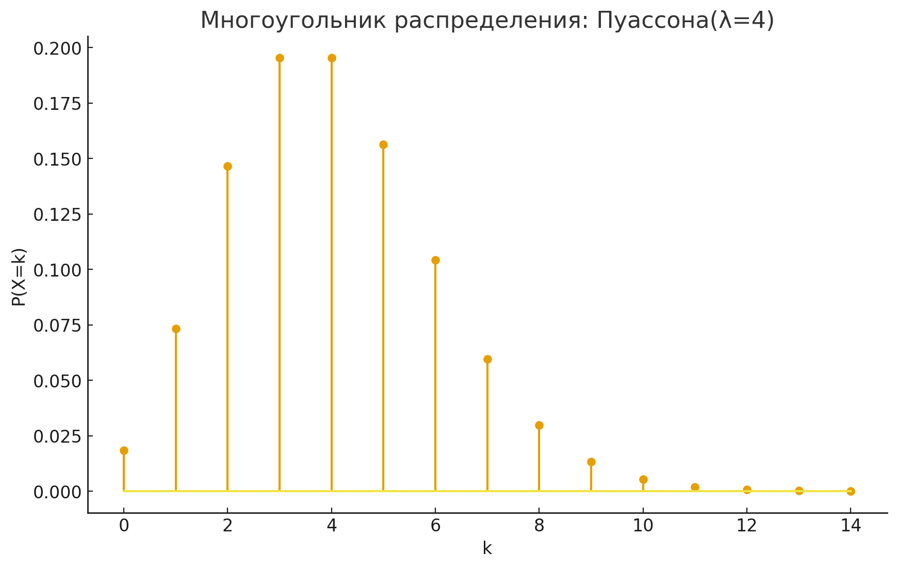

# Законы распределения дискретных случайных величин

**Формулировка:**

В службу поддержки приходит в среднем (\lambda=4) письма в час. (X) — число писем за 1 час.

Закон:

(в расчётах взял
 для таблицы).

Результаты:

- 
- 
- 
- мод(ы): при целом 
  две моды: 
  и   
  в общем для нецелого .

Таблица и график распределения

### [Решение](task.py)
